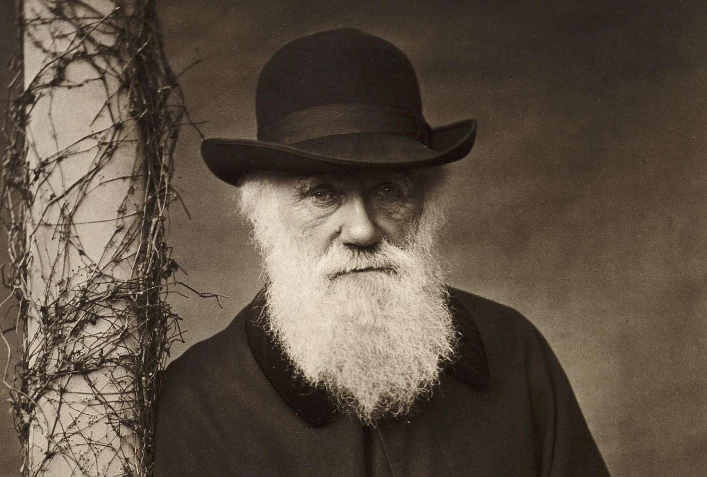
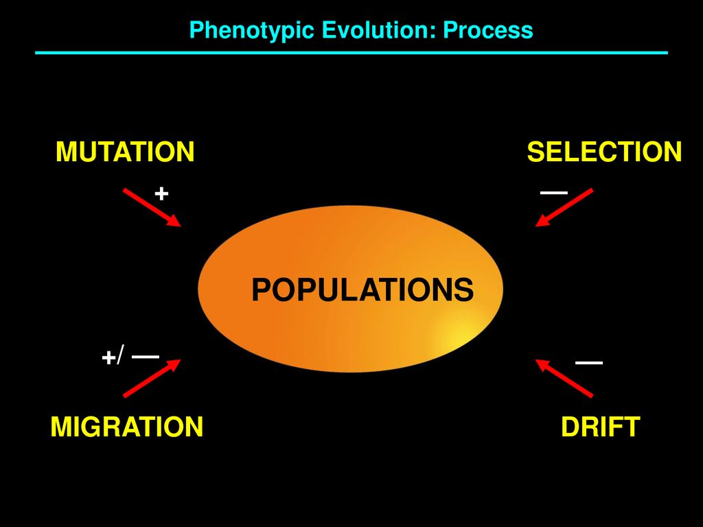
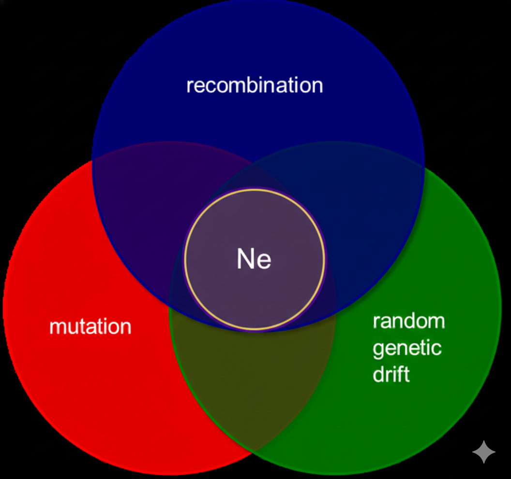
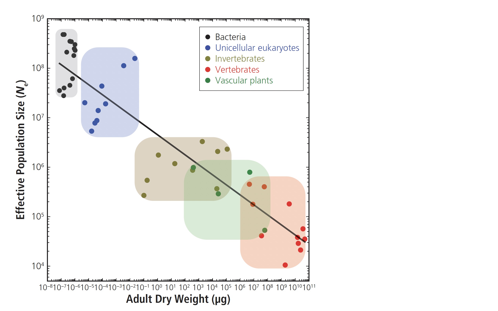
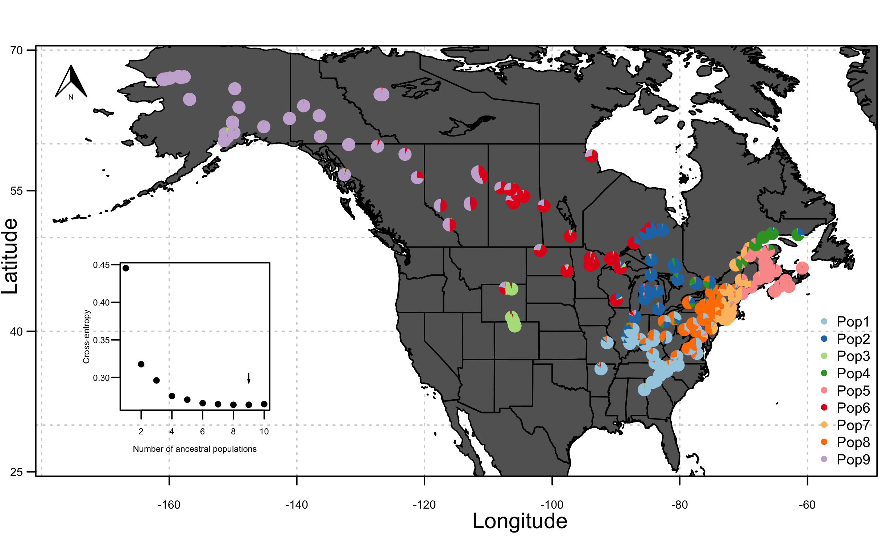
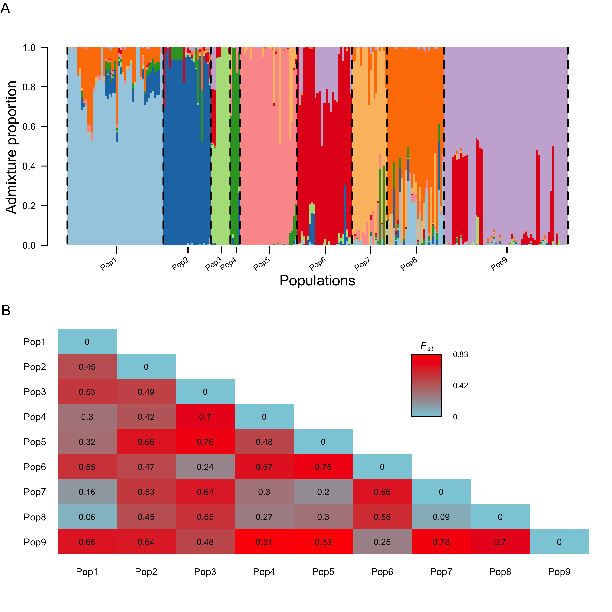
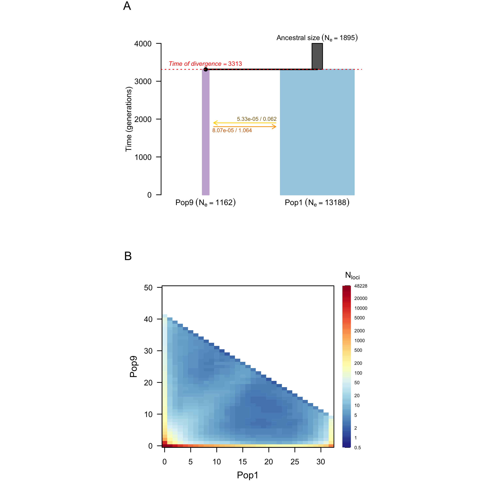
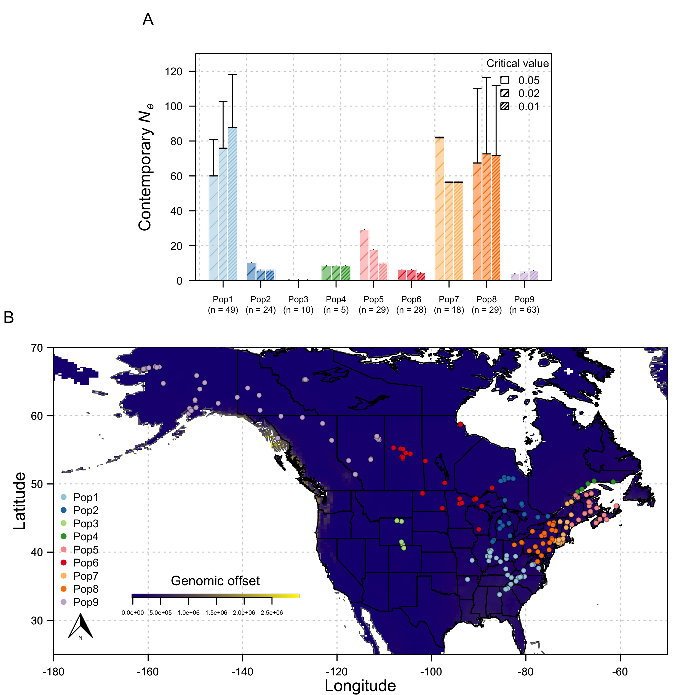
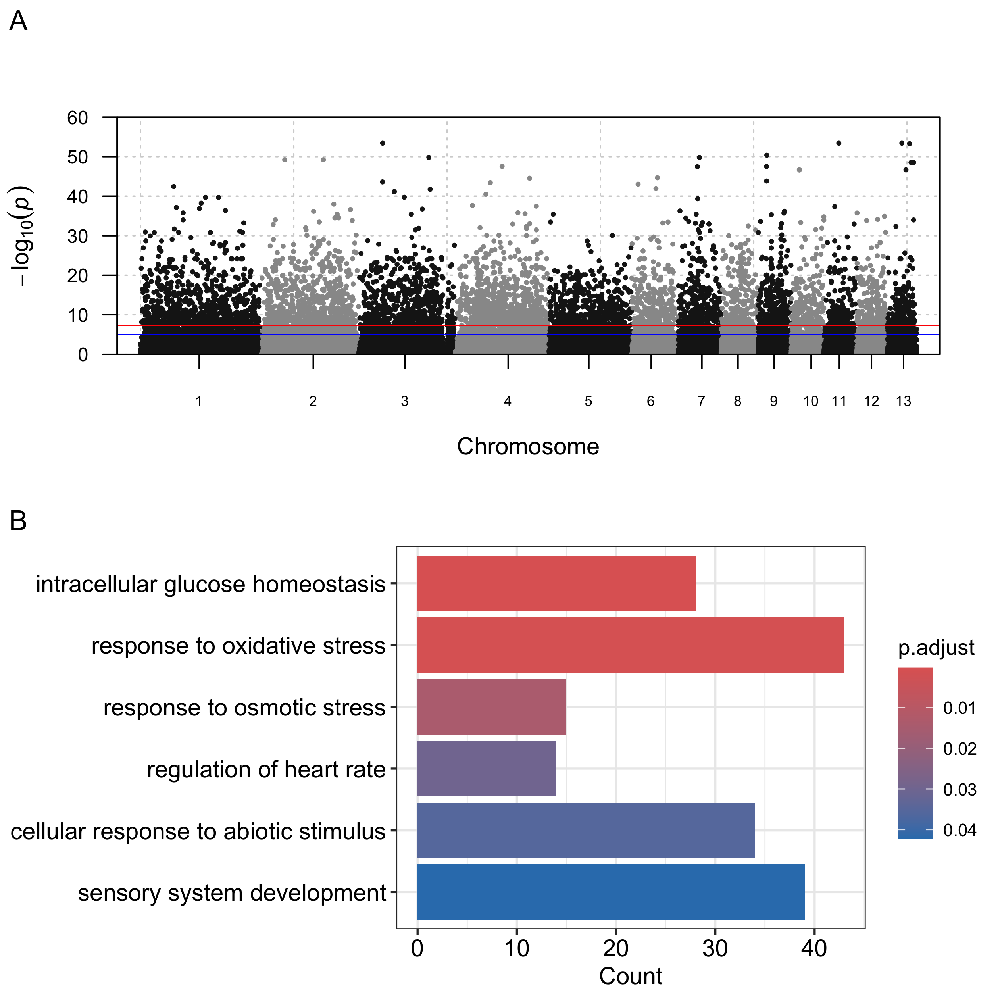

# []{style="font-family:Calibri;font-weight:normal;color:purple"} {background=''}

{width=80%}

# [SNPs under selection?]{style="font-family:Lato;font-weight:normal;color:purple;font-size:50px"} {background=''}

# [Mechanisms of Evolution]{style="font-family:Lato;font-weight:normal;color:purple;font-size:50px"} {background=''}

 

::::{.columns}

:::{.column width="50%"}

:::

:::{.column width="50%"}

:::

::::

# [Mechanisms of Evolution]{style="font-family:Lato;font-weight:normal;color:purple;font-size:50px"} {background=''}

 

::::{.columns}

:::{.column width="50%"}

:::

:::{.column width="50%"}

:::

::::

#

# [What is demographic history?]{style="font-family:Lato;font-weight:normal;color:purple;font-size:50px"} {background=''}

 

In population genetics, demographic history refers to reconstructing a population's past changes in *size*, structure, and migration patterns using genetic data, revealing events like expansions, contractions, bottlenecks, or gene flow that shape current genetic diversity and evolutionary forces like selection

#

#

#

#

#

